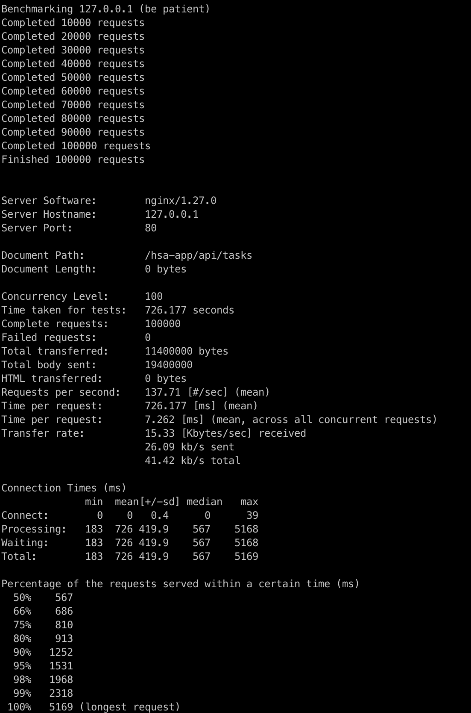

# HSA resource monitoring systems homwework
TIG monitoring stack setup:
- mongodb
- elasticsearch
- php-fpm (or custom app container)
- nginx


<h3>Data flow:</h3>
Nginx -> HSA-APP -> MongoDB, Elasticsearch

App endpoint to accept traffic:
```
POST http://localhost/hsa-app/api/tasks
```

<h3>Build system:</h3>
Prerequisite: Java 17 jdk is installed. <br/>
Run command:
```
./gradle clean build
```

<h3>Run system:</h3>
Prerequisite: Docker-compose is installed. <br/>
Run command:
```
docker-compose up -d
```

<h3>Apply load:</h3>
Run script:
```
./test-load.sh
```
Script execution result:


<h3>Validate data:</h3>
Check count for created documents in Elastic (custom index=taskindex):
```
GET http://localhost:9200/taskindex/_count?q=user:dmytro
```

<h3>System metrics:</h3>
